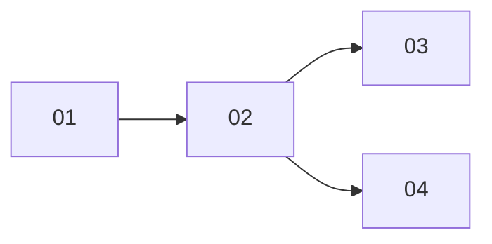

# SAENM Jupyter実験ワークフロー

SAENMモデル (Sequential Append-Only Experiment Notebook Model) に基づく実験ノート管理スキル。
参考: CMScomLab/saenm-notebook-template

## SAENMの3原則

- **Sequential**: 実験に単純な連番 (`01`, `02`, `03`...) を付与する。枝番は使わず、微細な更新でも次の番号を割り当てる。親子関係は INDEX.md で管理し、どの検討の続きかを常に追跡可能にする
- **Append-Only**: 過去のノートを改変・削除しない。修正は新ノートか Corrections セクションへの追記で行う。INDEX.md が履歴の一貫性を担保する
- **Experiment Notebook**: コード・結果に加え、目的・考察・環境情報・AI利用記録・次の方針を含む包括的な実験記録

## 適用条件の確認

スキルトリガー後、最初に以下を確認する:

1. 作業ディレクトリの確認 (新規 or 既存プロジェクト)
2. `notebooks/` ディレクトリの有無
3. `notebooks/INDEX.md` の有無
4. Git管理の有無 (`.git/` の存在で判定)

確認結果に応じてワークフロー (後述) の適切なパスを選択する。

## 最小構成

SAENMの核は `notebooks/` と INDEX.md のみ。Git不要で完全に機能する:

```
project-root/
├── notebooks/
│   ├── INDEX.md            # 実験索引 (必須・追記専用)
│   ├── 01_initial-exploration.ipynb
│   ├── 02_improved-method.ipynb
│   └── 03_parameter-tuning.ipynb
└── data/                   # (推奨) 入力データ
    └── raw/
```

必要に応じて追加:
- `src/` - 再利用コードモジュール
- `results/` - 出力結果
- `docs/` - 運用ルール
- `tests/` - テストコード
- `pyproject.toml` - Pythonプロジェクト設定

## INDEX.md (実験索引)

Append-Onlyを構造的に担保する中核ファイル。各実験のメタデータを追記していく。

テーブル形式:

```markdown
# 実験索引

| ID | タイトル | 親 | 作成日 | 状態 | 生成物 |
|----|---------|-----|--------|------|--------|
| 01 | 初期データ探索 | - | 2026-04-06 | 完了 | results/01/ |
| 02 | 手法改善 | 01 | 2026-04-07 | 完了 | results/02/ |
| 03 | パラメータ調整 | 02 | 2026-04-07 | 進行中 | - |
| 04 | 別手法の試行 | 02 | 2026-04-08 | 完了 | results/04/ |
```

系列関係はMermaid記法で可視化する:

````markdown
## 系列関係


````

### INDEX.md 運用ルール

- **追記のみ**。既存行の削除・状態の巻き戻し禁止
- 状態の更新 (進行中 → 完了) は許容
- 新しい実験を作成するたびに必ず行を追加する
- Mermaid図に親子関係を追記する (同じ親から複数の子が出る場合あり)

## ノート命名規則

形式: `{ID}_{kebab-case-タイトル}.ipynb`

- 常に**単純連番** (`01`, `02`, `03`...)。枝番 (`02a` 等) は使わない
- 微細な更新・パラメータ変更でも次の番号を割り当てる (試行の粒度は小さくてよい)
- IDは `notebooks/` 内の既存最大番号+1 で自動決定
- 親子関係はIDの連続性ではなく INDEX.md の「親」列で管理する

例:
```
01_data-collection.ipynb       # (親: なし)
02_feature-extraction.ipynb    # (親: 01)
03_model-training.ipynb        # (親: 02)
04_hyperparameter-search.ipynb # (親: 03) パラメータ変更だけでも新番号
05_alternative-model.ipynb     # (親: 03) 同じ親から別方向の試行
06_evaluation.ipynb            # (親: 04)
```

## ノート内部構造テンプレート

各ノートは以下のMarkdownセクションを含む。第三者が追跡・再実行できる情報を網羅する:

```markdown
# {ID}: {実験タイトル}

## メタデータ
- 親実験: {親ID or "なし"}
- 実行日時: {YYYY-MM-DD HH:MM}
- 実行環境: {Python版, OS, 主要ライブラリ版}
- 入力データ: {パスと版 (ハッシュ or 取得日時)}
- 乱数seed: {seed値 or "未固定"}

## 目的
- この実験で検証したい仮説・達成したい目標
- 前回実験からの経緯 (親: {ID} を参照)

## 手法
- 使用するアルゴリズム・ライブラリ
- 実験条件・パラメータ

## 実行
(コードセル群)

## 結果
- 実行結果の要約
- 図表・メトリクスの説明
- 生成物のパス

## 考察
- 結果から何が言えるか
- 予想との一致/不一致
- 失敗した場合: 失敗の理由と学び

## AI利用記録 (該当する場合)
- AIへの問いかけ内容
- AIの提案のうち採用/修正/棄却した箇所と理由
- 人間が最終判断した内容 (AIに委ねなかった判断)

## 次のステップ
- 次に試すべきこと
- 残課題・疑問点
- 次の実験への引き継ぎ事項

## Corrections (該当する場合)
- {日付}: {修正内容と理由}
```

## 運用原則 (Append-Onlyルール)

### Do

- 新しい試行は**新しいノート**として追加する
- 失敗した実験もそのまま残す。判断の変遷自体が知見になる
- INDEX.md に新しい行を追記する
- 過去ノートの誤りは Corrections セクションに追記で記録する

### Don't

- 過去のノートのコード・結果を書き換えない
- 失敗したノートを削除しない
- INDEX.md の既存行を削除しない

## ワークフロー (エージェント実行手順)

### 新規プロジェクト開始

1. 作業ディレクトリを確認する
2. `notebooks/` ディレクトリを作成する
3. `notebooks/INDEX.md` を空のテーブルヘッダーとMermaid図で作成する
4. ユーザーに最初の実験の目的をヒアリングする
5. `01_{タイトル}.ipynb` をテンプレートに基づいて作成する
6. INDEX.md に最初の行とMermaidノードを追記する
7. (Git管理時) コミットを提案する

### 新規実験追加

1. `notebooks/` 内の既存 `.ipynb` ファイルを走査する
2. INDEX.md を読み取り、現在の系列関係を把握する
3. 親実験を特定する (ユーザーに確認)
4. 次のIDを決定する: 既存最大番号+1 (常に単純連番)
5. 新しいノートをテンプレートで作成する (メタデータに親ID記入)
6. INDEX.md に行とMermaidエッジを追記する

### 既存ノート修正の要求への応答

**原則: 既存ノートの内容は改変しない。** 要求の種類に応じて対応を分ける:

- **typo/Markdown整形**: 許容する (実験内容に影響しないため)
- **結果の訂正・コード修正**: 既存ノートの Corrections セクションに追記するか、新しいノートとして作成することを提案する
- **「この実験をやり直したい」**: 次の連番で新しいノートとして作成を提案する

### 実験系列の振り返り

1. INDEX.md を読み取り、系列関係を把握する
2. 各ノートの「目的」「考察」「次のステップ」セクションを読み取る
3. 時系列で実験の流れを要約する:
   - 仮説の変遷
   - 判断の分岐点と理由
   - 各実験の主要な学び
4. 未着手の「次のステップ」をリストアップする
5. 次に取り組むべき方向性を提案する

## Git連携 (オプション)

`.git/` が存在する場合のみ適用する。

### プロジェクト初期化

- **Nix環境**: `nix flake init -t github:peacock0803sz/templa#notebook` でセットアップする
  - flake.nix に git-hooks.nix 経由で ruff-check / ruff-format / ty が pre-commit に設定済み
  - devShell に uv が含まれる
  - `uv sync` で JupyterLab 等の依存関係をインストールする
- **非Nix環境**: 手動で pre-commit を設定する
  - `uv add --dev ruff pre-commit` でインストールする
  - `.pre-commit-config.yaml` に ruff check (`ruff check --fix`) を設定する
  - `pre-commit install` で有効化する

### Git運用ルール

- ノート追加ごとにコミットを推奨する
- コミットメッセージは `/commit` スキルに従う。プレフィックスは `{ID}: ` (例: `03: Add hyperparameter search`)
- .ipynb の差分が見づらい場合は nbstripout や jupytext の導入を検討する
- `data/raw/` は .gitignore に追加し、データ取得手順をドキュメント化する

### Git非管理時

- INDEX.md の連番とメタデータが履歴を担保する
- 定期的なディレクトリバックアップを推奨する
