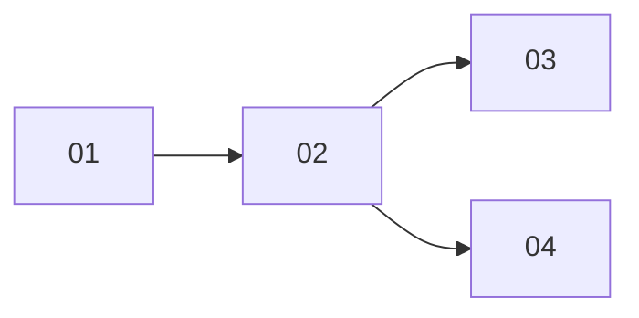

# README.md (実験索引) 仕様

Append-Onlyを構造的に担保する中核ファイル。各実験のメタデータを追記していく。

## テーブル形式

```markdown
# 実験索引

| ID | タイトル | 親 | 作成日 | 状態 | 生成物 |
|----|---------|-----|--------|------|--------|
| 01 | 初期データ探索 | - | 2026-04-06 | 完了 | results/01/ |
| 02 | 手法改善 | 01 | 2026-04-07 | 完了 | results/02/ |
| 03 | パラメータ調整 | 02 | 2026-04-07 | 進行中 | - |
| 04 | 別手法の試行 | 02 | 2026-04-08 | 完了 | results/04/ |
```

## 系列関係 (Mermaid)

系列関係はMermaid記法で可視化する。

````markdown
## 系列関係


````

## 運用ルール

- 追記のみ。既存行の削除・状態の巻き戻しは禁止
- 状態の更新 (進行中 → 完了) は許容
- 新しい実験を作成するたびに必ず行を追加する
- Mermaid図に親子関係を追記する。同じ親から複数の子が出る場合もある
