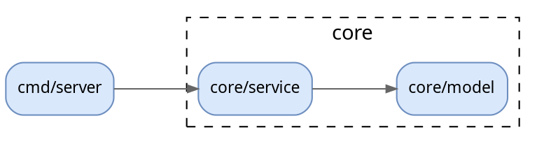

# D2 リファレンス

d2 v0.9 系で動作確認した書き方をまとめる。

## 実行

```bash
nix run nixpkgs#d2 -- in.d2 out.svg
nix run nixpkgs#d2 -- fmt in.d2          # 整形
```

レイアウトエンジンやテーマはファイル側の `vars.d2-config` に書く。CLI 引数に頼らなければ、ファイル単体で再現できる。

```d2
vars: {
  d2-config: {layout-engine: elk; theme-id: 0}
}
```

- `elk`: 入れ子の境界が多い構成図に向く。エッジが直交で整う。既定はこちら
- `dagre`: 階層が浅いフロー図だと詰まって見やすいことがある。elk で間延びしたら試す
- PNG 出力(`out.png`)は Playwright を要求するので使わない。確認には rsvg-convert を使う

## 構成図の骨格

```d2
vars: {
  d2-config: {layout-engine: elk; theme-id: 0}
  d2-legend: {
    svc: サービス {class: svc}
    db: DB {class: db}
    q: キュー {class: queue}
    ext: 外部システム {class: ext}
    # エッジだけを凡例に出すには、端点を opacity 0 にする
    a: {style.opacity: 0}
    b: {style.opacity: 0}
    a -> b: 非同期メッセージ {class: async}
  }
}

classes: {
  svc: {style: {fill: "#dae8fc"; stroke: "#6c8ebf"; border-radius: 6}}
  db: {shape: cylinder; style: {fill: "#d5e8d4"; stroke: "#82b366"}}
  queue: {shape: queue; style: {fill: "#fff2cc"; stroke: "#d6b656"}}
  ext: {style: {fill: "#f5f5f5"; stroke: "#666666"; stroke-dash: 4}}
  boundary: {style: {fill: transparent; stroke: "#666666"; stroke-dash: 4}}
  async: {style.stroke-dash: 3}
}

title: |md
  # 注文システム コンテナ図
| {near: top-center}

direction: right

user: 購入者 {shape: person}
aws: AWS ap-northeast-1 {
  vpc: VPC {
    class: boundary
    api: "Order API\n(Go)" {class: svc}
    db: "orders DB\n(PostgreSQL)" {class: db}
  }
  q: "order-events\n(SQS)" {class: queue}
}
stripe: Stripe {class: ext}

user -> aws.vpc.api: HTTPS/JSON
aws.vpc.api -> aws.vpc.db: SQL
aws.vpc.api -> aws.q: publish OrderPlaced {class: async}
aws.vpc.api -> stripe: REST
```

要点:

- 入れ子はブロックで書き、参照はドット区切りの完全パス(`aws.vpc.api`)にする。パスを間違えると、エラーにならずに新しいノードが黙って増える。レンダリング後にノード数をモデルと突き合わせるのはこのため
- 改行を含むラベルは `"..."` で囲って `\n` を使う
- ID に日本語を使えるが、エッジで参照しにくい。ID は英字、ラベルは日本語にする
- 双方向は `<->`、向きのない線は `--`
- 同じ2ノード間にエッジを複数書くと、別々の線になる

## よく使う shape

`rectangle`(既定), `cylinder`(DB), `queue`, `person`, `cloud`, `package`, `page`, `document`, `stored_data`, `hexagon`, `oval`, `diamond`, `text`(枠なし文字), `sql_table`, `class`, `sequence_diagram`

`sql_table` は ER 図の代わりになる:

```d2
users: {
  shape: sql_table
  id: int {constraint: primary_key}
  email: text {constraint: unique}
}
orders: {
  shape: sql_table
  id: int {constraint: primary_key}
  user_id: int {constraint: foreign_key}
}
orders.user_id -> users.id
```

## シーケンス図

`shape: sequence_diagram` はファイルのトップレベルに書く。コンテナに入れると、コンテナ名が見出しとして描かれてしまう。

```d2
shape: sequence_diagram

title: ログイン {near: top-center; shape: text; style.font-size: 24}

u: ユーザー
app: モバイルアプリ
auth: 認証サーバー
db: ユーザーDB

u -> app: ID/パスワード入力
app -> auth: POST /token
auth -> db: SELECT user
db -> auth: password hash {style.stroke-dash: 3}

認証失敗: {
  auth -> app: 401 {style.stroke-dash: 3}
}

auth -> app: 200 access_token (JWT) {style.stroke-dash: 3}
app."トークンは Keychain に保存"
app -> u: ホーム画面
```

- アクターは最初に宣言した順に左から並ぶ。宣言を先頭にまとめて順序を固定する
- 応答(戻り)は破線にして、呼び出しと区別する
- 接続のないグループ(`認証失敗: {...}`)は、alt/loop のようなフラグメント枠になる
- アクターの子として接続のない文字列を置くと、ノートになる
- メッセージは 15 個程度までにする。それを超えるなら、処理のフェーズごとに図を分ける

## Graphviz(大規模な依存グラフ)

import グラフのように数十〜数百ノードで、境界の入れ子がほとんど無いときは Graphviz の方が速く、崩れにくい。

```bash
nix shell nixpkgs#graphviz -c dot -Tsvg deps.dot -o deps.svg
```



- 日本語ラベルには `fontname="Hiragino Sans"` を付ける。付けないと、macOS 以外でレンダリングしたときに豆腐になることがある
- 数百ノードになったら、読める図にはならない。パッケージ単位に集約するか、`unflatten -l 3` を通してから描く
